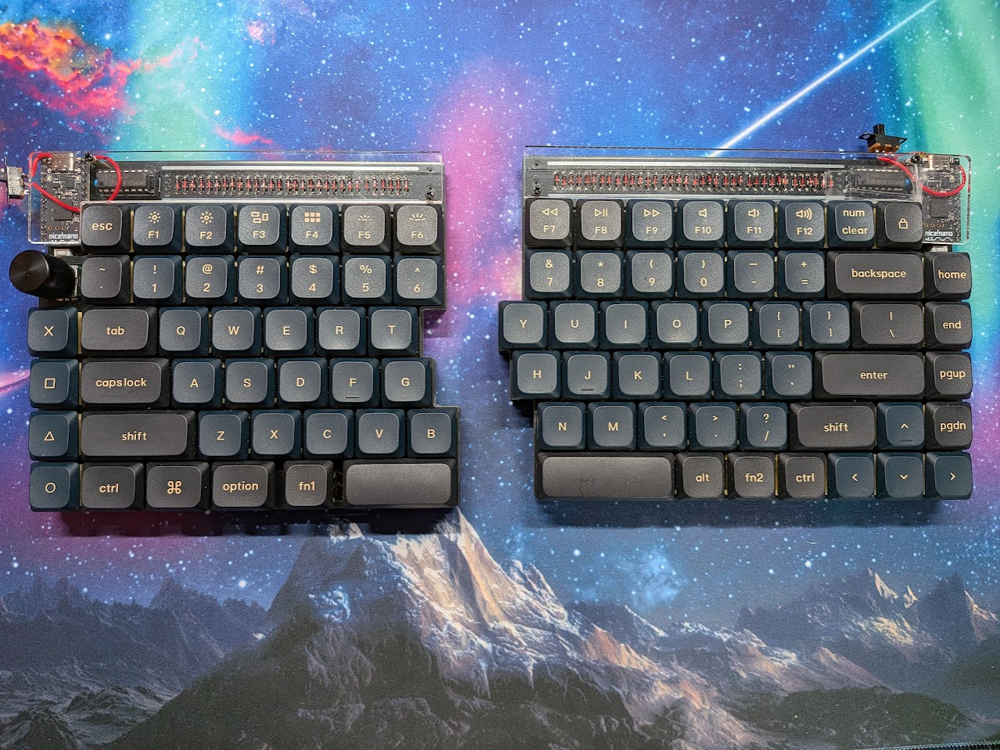

# Wireless nullbits SNAP ZMK Configuration

75% split, standard stagger, fully-wireless, bluetooth ZMK keyboard based on the nullbits SNAP kit.

Yes the switches are jank, and I broke some plastic already. I have plans to fix those. 

Side note - I did use Google Antigravity to help me with this README and some of the code updates, as I'm sure you can tell. This was a good low-stakes project for me to mess around with this stuff.

---

## 🎯 Motivation & Goals

* **Ergonomics & Comfort:** Due to a shoulder impingement, split keyboards feel a lot better to type with.
* **True Portability:** I wanted a lightweight, cable-free keyboard that I could throw in a bag, pull out, turn on, and immediately start using - I don't have a dedicated desk or office at work.
* **Standard Keyboard Layout:** Commercial wireless split keyboards at the time were either non-traditional stagger or extremely expensive which enough reviews about connectivity issues to make me hesitate. I really did not want to lose month of productivity learning how to go back and forth between my laptop keyboard and columnar stagger or layered keyboards.

While I thoroughly enjoyed the build process, Keychron released the split-layout Q11 right after I finished. Had it existed at the time, I probably would have just bought that instead.

---

## 🛠️ Parts List

| Component | Part Name & Links | Notes / Description |
| :--- | :--- | :--- |
| **Keyboard Kit** | [nullbits SNAP Kit (Amazon)](https://www.amazon.com/dp/B0DJNLY5NX) | Split 75% through-hole DIY mechanical keyboard kit. |
| **Plate** | [nullbits SNAP Plate (Amazon)](https://www.amazon.com/dp/B09TF9QLCW) | Structural switch plate for the SNAP. |
| **Controllers** | 2x [nice!nano v2.0](https://typeractive.xyz/products/nice-nano) | BLE-capable, Pro Micro-compatible microcontrollers. |
| **Sockets & Headers** | 2x [EZ-Solder Machine Sockets](https://typeractive.xyz/products/ez-machine-sockets-and-headers) | Allows easy hot-swapping/socketing of the microcontrollers. |
| **Batteries** | 2x [3.7V 110mAh Li-Po Batteries](https://typeractive.xyz/products/lithium-battery-110mah) | Solder-mounted to the nice!nanos. |
| **Switches** | 90x [Tecsee Medium Linear Switches](https://lumekeebs.com/products/tecsee-medium-switches) | Medium-travel linear switches. |
| **Keycaps** | [Keychron Low-Profile Double-Shot PBT LSA (V2)](https://www.keychron.com/products/low-profile-double-shot-pbt-lsa-keycap-set-version-2/) | Low-profile keycap set. |
| **Mill-Max Hotswap Sockets** | 3x [Keeb.io 0305-2 Tin sockets](https://keeb.io/products/mill-max-hotswap-socket) | Makes it easier to swap switches in the future if one dies, or you change you mind. |
| **Power Switches** | [Slide Power Switches (Amazon)](https://www.amazon.com/dp/B0G5YNZCTJ) | Purchased for physical battery/power switching. |

I also purchased a couple of switch test kits from Aliexpress before I purchased the full set that I needed.

* https://www.aliexpress.us/item/3256806596444974.html
* https://www.aliexpress.us/item/3256805423629141.html

---

## 📝 What's Left to Do

- [ ] **3D Print a Sturdier Case:** Because this keyboard travels in my backpack, the bare through-hole build isn't quite sturdy enough (one of the clear acrylic top bars has already broken). I plan to modify and print the [SNAP2 WIP case on Printables](https://www.printables.com/model/304284-snap2-wip) to accommodate the macro keys and larger batteries.
- [ ] **Swap for Larger Batteries:** The current 110mAh batteries only last about 3 days on a full charge. I plan to upgrade to larger capacity batteries to extend travel usability.
- [ ] **Keymap Layout Fine-Tuning:** Continuously refine custom key combinations and macro keys as I get more real-world typing time on the board.
- [ ] **Add Stabalizers:** I bought regular profile stabalizers, but I need to buy the special Tecsee ones since my switches are medium profile.

---

## 📚 References & Resources

Since no single, all-in-one wireless SNAP build guide existed, this build was assembled using a mix of resources:
* **Assembly Guide:** The [nullbits SNAP Official Build Guide](https://github.com/nullbitsco/docs/blob/main/snap/build_guide_en.md) and a complete [nullbits SNAP Video Build Guide (YouTube)](https://www.youtube.com/watch?v=zd0gaJw4Wnw).
* **Wireless Design Inspiration:** This [Reddit thread on a wireless SNAP build](https://www.reddit.com/r/nullbits/comments/10i3ivv/fully_wireless_snap_75_build_with_eink_display/) provided useful tips on adding Bluetooth components.
* **Firmware Configuration:** The official [ZMK Hardware & Setup Documentation](https://zmk.dev/docs/hardware) was used for setting up the nice!nano board support.
